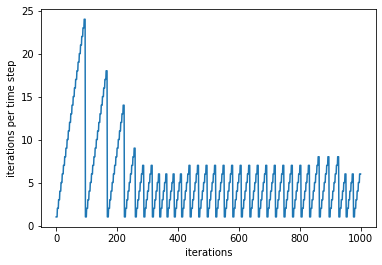

[](https://zenodo.org/badge/latestdoi/179541372)
# ogs6py

ogs6py is a python-API for the OpenGeoSys finite element sofware.
Its main functionalities include creating and altering OGS6 input files as well as executing OGS.
The package allows to streamline OGS-workflows with python or Julia entirely in jupyter or pluto notebooks as demonstrated in the following video:


[](https://www.youtube.com/watch?v=eihNKjK-I-s)


<span style="color:red">*Please note: due to changes in the file structure ogs6py is now imported by `from ogs6py.ogs import OGS`*</span>

To alter and execute OGS input, e.g., for looping over parameter ranges, two approaches exist: 

    1. creating a new input file using python method calls
    2. altering existing input files

### 1. Creating a new input file
 
The following example consists of a simle mechanics problem. The names of the method calls are based on the corresponing XML tags. The `MKL=True` option executes `source /opt/intel/mkl/bin/mklvars.sh intel64` before the ogs call.


```python
from ogs6py.ogs import OGS

model = OGS(PROJECT_FILE="simple_mechanics.prj", MKL=True)
model.geo.addGeom(filename="square_1x1.gml")
model.mesh.addMesh(filename="square_1x1_quad_1e2.vtu")
model.processes.setProcess(name="SD",
                           type="SMALL_DEFORMATION",
                           integration_order=2,
                           solid_density="rho_sr",
                           specific_body_force="0 0")
model.processes.setConstitutiveRelation(type="LinearElasticIsotropic",
                                        youngs_modulus="E",
                                        poissons_ratio="nu")
model.processes.addProcessVariable(process_variable="process_variable",
                                   process_variable_name="displacement")
model.processes.addProcessVariable(secondary_variable="sigma",
                                   output_name="sigma")
model.timeloop.addProcess(process="SD",
                          nonlinear_solver_name="basic_newton",
                          convergence_type="DeltaX",
                          norm_type="NORM2",
                          abstol=1e-15,
                          time_discretization="BackwardEuler")
model.timeloop.setStepping(process="SD", type="FixedTimeStepping",
                           t_initial=0,
                           t_end=1,
                           repeat=4,
                           delta_t=0.25)
model.timeloop.addOutput(type="VTK",
                         prefix="blubb",
                         repeat=1,
                         each_steps=10,
                         variables=["displacement", "sigma"])
model.parameters.addParameter(name="E", type="Constant", value=1)
model.parameters.addParameter(name="nu", type="Constant", value=0.3)
model.parameters.addParameter(name="rho_sr", type="Constant", value=1)
model.parameters.addParameter(name="displacement0",
                              type="Constant",
                              values="0 0")
model.parameters.addParameter(name="dirichlet0", type="Constant", value=0)
model.parameters.addParameter(name="dirichlet1", type="Constant", value=0.05)
model.processvars.setIC(process_variable_name="displacement",
                        components=2,
                        order=1,
                        initial_condition="displacement0")
model.processvars.addBC(process_variable_name="displacement",
                        geometrical_set="square_1x1_geometry",
                        geometry="left",
                        type="Dirichlet",
                        component=0,
                        parameter="dirichlet0")
model.processvars.addBC(process_variable_name="displacement",
                        geometrical_set="square_1x1_geometry",
                        geometry="bottom",
                        type="Dirichlet",
                        component=1,
                        parameter="dirichlet0")
model.processvars.addBC(process_variable_name="displacement",
                        geometrical_set="square_1x1_geometry",
                        geometry="top",
                        type="Dirichlet",
                        component=1,
                        parameter="dirichlet1")
model.nonlinsolvers.addNonlinSolver(name="basic_newton",
                                    type="Newton",
                                    max_iter=4,
                                    linear_solver="general_linear_solver")
model.linsolvers.addLinSolver(name="general_linear_solver",
                              kind="lis",
                              solver_type="cg",
                              precon_type="jacobi",
                              max_iteration_step=10000,
                              error_tolerance=1e-16)
model.linsolvers.addLinSolver(name="general_linear_solver",
                              kind="eigen",
                              solver_type="CG",
                              precon_type="DIAGONAL",
                              max_iteration_step=10000,
                              error_tolerance=1e-16)
model.linsolvers.addLinSolver(name="general_linear_solver",
                              kind="petsc",
                              solver_type="cg",
                              precon_type="bjacobi",
                              max_iteration_step=10000,
                              error_tolerance=1e-16)
model.writeInput()
```


    True


```python
model.runModel(path="~/github/ogs/build_mkl/bin")
```

    OGS finished with project file simple_mechanics.prj.
    Execution took 0.0639185905456543 s


An example using the MPL can be find in example_THM.py.

### 2. Alternatively it is possible to alter existing files using the available replace methods:

E.g., to iterate over three Young's moduli one can use the replace parameter method:


```python
Es = [1,2,3]
filename = "simple_mechanics.prj"
for E in Es:
    model = OGS(INPUT_FILE=filename, PROJECT_FILE=filename, MKL=True)
    model.replaceParameter(name="E", value=E)
    model.replaceTxt("out_E="+str(E), xpath="./time_loop/output/prefix")
    model.writeInput()
    model.runModel(path="~/github/ogs/build_mkl/bin")
```

    OGS finished with project file simple_mechanics.prj.
    Execution took 0.06496095657348633 s
    OGS finished with project file simple_mechanics.prj.
    Execution took 0.05861473083496094 s
    OGS finished with project file simple_mechanics.prj.
    Execution took 0.056302547454833984 s


Instead of the `replaceParameter` method, the more general `replaceTxt` method can be used


```python
model.replaceTxt(E, xpath="./parameters/parameter[name='E']/value")
```

The Young's modulus in this file can also be accessed through 0'th occurrence of the place addressed by the xpath `./parameters/parameter/value`


```python
model.replaceTxt(E, xpath="./parameters/parameter/value", occurrence=0)
```

For MPL based processes, there exist specific functions to set phase and medium properties: E.g.,


```python
model.replacePhaseProperty(mediumid=0, phase="Solid", name="thermal_expansivity", value="42")
```

for a phse property and


```python
model.replaceMediumProperty(mediumid=0, name="porosity", value="0.24")
```

for a property that lives on the medium level.

## 3. Log-Parser
To parse the output that is piped into a file named `out.log` you can simply do:


```python
df = model.parseOut("out_thm.log")
```


```python
df
```


<div>
<style scoped>
    .dataframe tbody tr th:only-of-type {
        vertical-align: middle;
    }

    .dataframe tbody tr th {
        vertical-align: top;
    }

    .dataframe thead th {
        text-align: right;
    }
</style>
<table border="1" class="dataframe">
  <thead>
    <tr style="text-align: right;">
      <th></th>
      <th>execution_time</th>
      <th>time_step/number</th>
      <th>time_step/t</th>
      <th>time_step/dt</th>
      <th>time_step/cpu_time</th>
      <th>time_step/output_time</th>
      <th>time_step/iteration/number</th>
      <th>time_step/iteration/assembly_time</th>
      <th>time_step/iteration/dirichlet_bc_time</th>
      <th>time_step/iteration/linear_solver_time</th>
      <th>time_step/iteration/cpu_time</th>
      <th>time_step/iteration/component_convergence/number</th>
      <th>time_step/iteration/component_convergence/dx</th>
      <th>time_step/iteration/component_convergence/x</th>
      <th>time_step/iteration/component_convergence/dx_relative</th>
    </tr>
  </thead>
  <tbody>
    <tr>
      <th>0</th>
      <td>25.2781</td>
      <td>1</td>
      <td>1.0</td>
      <td>1.0</td>
      <td>2.478990</td>
      <td>0.013315</td>
      <td>1</td>
      <td>0.035883</td>
      <td>0.004113</td>
      <td>0.091469</td>
      <td>0.132779</td>
      <td>0</td>
      <td>1.884600e+04</td>
      <td>2.091500e+04</td>
      <td>9.010800e-01</td>
    </tr>
    <tr>
      <th>1</th>
      <td>25.2781</td>
      <td>1</td>
      <td>1.0</td>
      <td>1.0</td>
      <td>2.478990</td>
      <td>0.013315</td>
      <td>1</td>
      <td>0.035883</td>
      <td>0.004113</td>
      <td>0.091469</td>
      <td>0.132779</td>
      <td>1</td>
      <td>8.858200e+09</td>
      <td>8.858200e+09</td>
      <td>1.000000e+00</td>
    </tr>
    <tr>
      <th>2</th>
      <td>25.2781</td>
      <td>1</td>
      <td>1.0</td>
      <td>1.0</td>
      <td>2.478990</td>
      <td>0.013315</td>
      <td>1</td>
      <td>0.035883</td>
      <td>0.004113</td>
      <td>0.091469</td>
      <td>0.132779</td>
      <td>2</td>
      <td>4.439300e-04</td>
      <td>4.439300e-04</td>
      <td>1.000000e+00</td>
    </tr>
    <tr>
      <th>3</th>
      <td>25.2781</td>
      <td>1</td>
      <td>1.0</td>
      <td>1.0</td>
      <td>2.478990</td>
      <td>0.013315</td>
      <td>1</td>
      <td>0.035883</td>
      <td>0.004113</td>
      <td>0.091469</td>
      <td>0.132779</td>
      <td>3</td>
      <td>4.579000e-04</td>
      <td>4.579000e-04</td>
      <td>1.000000e+00</td>
    </tr>
    <tr>
      <th>4</th>
      <td>25.2781</td>
      <td>1</td>
      <td>1.0</td>
      <td>1.0</td>
      <td>2.478990</td>
      <td>0.013315</td>
      <td>2</td>
      <td>0.033763</td>
      <td>0.003531</td>
      <td>0.064117</td>
      <td>0.102725</td>
      <td>0</td>
      <td>4.063800e+03</td>
      <td>2.458900e+04</td>
      <td>1.652700e-01</td>
    </tr>
    <tr>
      <th>...</th>
      <td>...</td>
      <td>...</td>
      <td>...</td>
      <td>...</td>
      <td>...</td>
      <td>...</td>
      <td>...</td>
      <td>...</td>
      <td>...</td>
      <td>...</td>
      <td>...</td>
      <td>...</td>
      <td>...</td>
      <td>...</td>
      <td>...</td>
    </tr>
    <tr>
      <th>995</th>
      <td>25.2781</td>
      <td>31</td>
      <td>50000.0</td>
      <td>4514.0</td>
      <td>0.581043</td>
      <td>0.014266</td>
      <td>5</td>
      <td>0.035133</td>
      <td>0.002944</td>
      <td>0.055049</td>
      <td>0.094542</td>
      <td>3</td>
      <td>3.180600e-17</td>
      <td>7.074400e-03</td>
      <td>4.496000e-15</td>
    </tr>
    <tr>
      <th>996</th>
      <td>25.2781</td>
      <td>31</td>
      <td>50000.0</td>
      <td>4514.0</td>
      <td>0.581043</td>
      <td>0.014266</td>
      <td>6</td>
      <td>0.036252</td>
      <td>0.003204</td>
      <td>0.055754</td>
      <td>0.096534</td>
      <td>0</td>
      <td>6.841200e-12</td>
      <td>4.005500e+04</td>
      <td>1.708000e-16</td>
    </tr>
    <tr>
      <th>997</th>
      <td>25.2781</td>
      <td>31</td>
      <td>50000.0</td>
      <td>4514.0</td>
      <td>0.581043</td>
      <td>0.014266</td>
      <td>6</td>
      <td>0.036252</td>
      <td>0.003204</td>
      <td>0.055754</td>
      <td>0.096534</td>
      <td>1</td>
      <td>8.289800e-07</td>
      <td>5.261000e+08</td>
      <td>1.575700e-15</td>
    </tr>
    <tr>
      <th>998</th>
      <td>25.2781</td>
      <td>31</td>
      <td>50000.0</td>
      <td>4514.0</td>
      <td>0.581043</td>
      <td>0.014266</td>
      <td>6</td>
      <td>0.036252</td>
      <td>0.003204</td>
      <td>0.055754</td>
      <td>0.096534</td>
      <td>2</td>
      <td>4.418700e-18</td>
      <td>7.150300e-03</td>
      <td>6.179700e-16</td>
    </tr>
    <tr>
      <th>999</th>
      <td>25.2781</td>
      <td>31</td>
      <td>50000.0</td>
      <td>4514.0</td>
      <td>0.581043</td>
      <td>0.014266</td>
      <td>6</td>
      <td>0.036252</td>
      <td>0.003204</td>
      <td>0.055754</td>
      <td>0.096534</td>
      <td>3</td>
      <td>4.490900e-18</td>
      <td>7.074400e-03</td>
      <td>6.348100e-16</td>
    </tr>
  </tbody>
</table>
<p>1000 rows × 15 columns</p>
</div>


```python
import matplotlib.pyplot as plt
```


```python
plt.plot(df["time_step/iteration/number"])
plt.xlabel("iterations")
plt.ylabel("iterations per time step")
```


    Text(0, 0.5, 'iterations per time step')


    

    


```python

```
